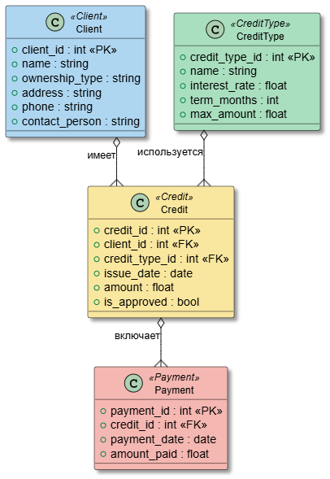
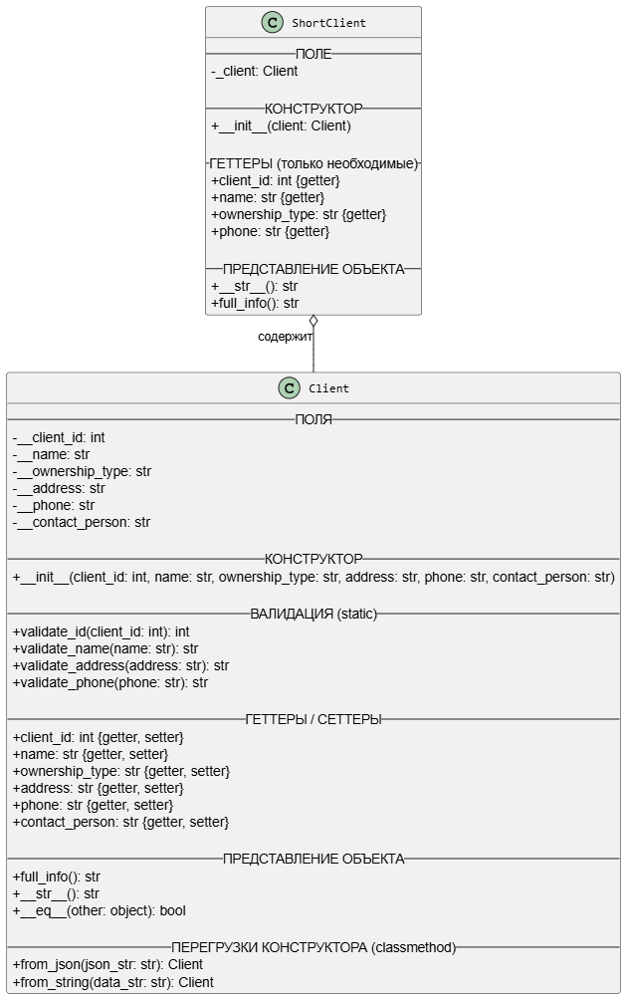

## Тема 

20. Выдача банком кредитов

**Описание предметной области**

Вы являетесь руководителем информационно-аналитического центра коммерческого банка. Одним из существенных видов деятельности банка является выдача кредитов юридическим лицам. Вашей задачей является отслеживание динамики работы кредитного отдела. 229 В зависимости от условий получения кредита, процентной ставки и срока возврата все кредитные операции делятся на несколько основных видов. Каждый из этих видов имеет свое название. Кредит может получить клиент, при регистрации предоставивший следующие сведения: название, вид собственности, адрес, телефон, контактное лицо. Каждый факт выдачи кредита регистрируется банком, при этом фиксируются сумма кредита, клиент и дата выдачи.

**Задание**
ЛР1.

Каждый пукнт - отдельный коммит - это обязательно. Коммиты называются нормально, поля и методы называются нормально.

Диаграмма классов обязательна - без неё работа не принимается

1. Выбрать тему, построить ER модель предметной области - 3-4 таблицы в 3НФ.

2. Выбрать независимую сущность с наибольшим числом полей (клиент, организация, студент, пользователь и тд) - дальше ЛР1 - ЛР4 работа только с этой сущностью

3. Построить полный класс этой сущности. Обеспечить инкапсуляцию ВСЕХ полей.

4. Сделать методы класса (статические) валидации всех необходимых полей. Сделать так, чтобы существование объекта с неразрешёнными полями было невозможно.

5. Убрать повтор кода из пункта 4.

6. Обеспечить перегрузку конcтруктора для нетривиальных примеров (строка, JSON и тд)

7. Обеспечить вывод на экран полной версии объекта и краткой версии объекта. Обеспечить сравнение объектов на равенство.

8. Создать класс, содержащий краткую версию данных исходного класса (например Фамилия Инициалы, только один контакт, ИНН ОГРН без адреса, без контактных лиц и тд).

9. Собрать два класса в одну иерархию наследования, обеспечить ОТСУТСТВИЕ повтора кода.

10. Нарисовать полную диаграмму классов. - БЕЗ диаграммы классов работа не принимается.

Теоретические вопросы.

1. Что такое класс, что такое объект, как создать объект класса?

2. В чем заключается принцип инкапсуляции? Как получить доступ к полям объекта из внешнего класса?

3. Что такое конструктор, зачем он нужен, как описывается конструктор в произвольном классе?

4. Опишите механизм создания объекта.

5. Что такое метод класса (статический), в чем его отличие от метода объекта? Приведите два практических примера, когда введение метода класса вы считаете необходимым согласно концепциям ООП.

6. Опишите структуру классов Вашего языка, как в нее вписывается написанный Вами класс?

7. Опишите принцип наследования, переопределение методов и способы вызова переопределенного метода.

8. Опишите принципы работы конструкторов для наследуемых классов.

9. Какие методы объекта обязательно есть у любого написанного Вами класса, опишите, что они делают.


## ER-Диаграмма


## Сущность клиент 

```python
class Client:

    def __init__(self, client_id: int, name: str, ownership_type: str,

                 address: str, phone: str, contact_person: str):

        self.__client_id = self.validate_id(client_id)

        self.__name = self.validate_name(name)

        self.__ownership_type = ownership_type.strip()

        self.__address = self.validate_address(address)

        self.__phone = self.validate_phone(phone)

        self.__contact_person = self.validate_name(contact_person)

  
  

    # ========== ГЕТТЕРЫ / СЕТТЕРЫ ==========

  

    @property

    def client_id(self):

        return self.__client_id

    @client_id.setter

    def client_id(self, value):

        self.__client_id = self.validate_id(value)

    @property

    def name(self):

        return self.__name

    @name.setter

    def name(self, value):

        self.__name = self.validate_name(value)

  

    @property

    def ownership_type(self):

        return self.__ownership_type

    @ownership_type.setter

    def ownership_type(self, value):

        self.__ownership_type = value.strip()

  

    @property

    def phone(self):

        return self.__phone

  

    @phone.setter

    def phone(self, value):

        self.__phone = self.validate_phone(value)

    @property

    def address(self):

        return self.__address

    @address.setter

    def address(self, value):

        self.__address = self.validate_address(value)

  

    @property

    def contact_person(self):

        return self.__contact_person

    @contact_person.setter

    def contact_person(self, value):

        self.__contact_person = self.validate_name(value)

```

## Валидация 
```python

    @staticmethod

    def validate_id(client_id: int) -> int:

        if not isinstance(client_id, int) or client_id <= 0:

            raise ValueError("ID клиента должен быть положительным числом")

        return client_id

  

    @staticmethod

    def validate_name(name: str) -> str:

        if not re.match(r'^[А-ЯЁ][а-яёА-ЯЁ\s\.\-]+$', name):

            raise ValueError("Название/ФИО должно начинаться с заглавной буквы и содержать только буквы, пробелы, тире или точки")

        return name.strip()

  

    @staticmethod

    def validate_address(address: str) -> str:

        if len(address.strip()) < 5:

            raise ValueError("Адрес слишком короткий")

        return address.strip()

  

    @staticmethod

    def validate_phone(phone: str) -> str:

        if not re.match(r'^\+?\d{7,15}$', phone):

            raise ValueError("Телефон должен содержать от 7 до 15 цифр и может начинаться с +")

        return phone
```

## Перегрузка конструктора 

```python 
 @classmethod

    def from_json(cls, json_str: str):

        data = json.loads(json_str)

        return cls(**data)

  

    @classmethod

    def from_string(cls, data_str: str):

        # строка вида: "1;ООО Ромашка;ООО;Москва, ул. Пушкина, 10;+79995553322;Иванов Иван Иванович"

        parts = data_str.split(";")

        if len(parts) != 6:

            raise ValueError("Неверный формат строки для создания клиента")

        return cls(int(parts[0]), parts[1], parts[2], parts[3], parts[4], parts[5])

```

## Представление объекта 

```python
def full_info(self):

        return (f"Клиент {self.name}, "

                f"Форма собственности: {self.ownership_type}, "

                f"Адрес: {self.address}, "

                f"Телефон: {self.phone}, "

                f"Контактное лицо: {self.contact_person}")

  

    def __str__(self):

        return f"{self.name} ({self.ownership_type})"

  

    def __eq__(self, other):

        return isinstance(other, Client) and self.client_id == other.client_id
```

## Композиция 
```python
class ShortClient:

    def __init__(self, client: Client):

        self._client = client  # храним ссылку на оригинальный объект

    @property

    def client_id(self):

        return self._client.client_id

    @property

    def name(self):

        return self._client.name

    @property

    def ownership_type(self):

        return self._client.ownership_type

    @property

    def phone(self):

        return self._client.phone

    def __str__(self):

        return f"{self.name}, тел.: {self.phone}"

    def full_info(self):

        return f"{self.name} ({self.ownership_type}) - {self.phone}"
```

## Вывод
```python


# 1. Через обычный конструктор

c1 = Client(1, "ООО Ромашка", "ООО", "Москва, ул. Пушкина, 10", "+79995553322", "Иванов Иван Иванович")

  

# 2. Через JSON

json_str = '{"client_id": 2, "name": "ЗАО Василёк", "ownership_type": "ЗАО", "address": "СПб, Невский 15", "phone": "+78125557788", "contact_person": "Петров Петр Петрович"}'

c2 = Client.from_json(json_str)

  

# 3. Через строку

str_data = "3;ИП Сидоров;ИП;Казань, Кремль, 1;+79270001122;Сидоров Сидор Сидорович"

c3 = Client.from_string(str_data)

  
  

# ===== Вывод информации =====

print("Краткая версия (str):")

print(c1)               # ООО Ромашка (ООО)

print(c2)               # ЗАО Василёк (ЗАО)

  

print("\nПолная версия (full_info):")

print(c1.full_info())

print(c2.full_info())

  

# ===== Сравнение =====

print("\nСравнение объектов:")

print(c1 == c2)  # False

c1_copy = Client(1, "ООО Ромашка", "ООО", "Москва, ул. Ленина, 99", "+79995553322", "Иванов Иван Иванович")

print(c1 == c1_copy)  # True (id одинаковый)

  
  

# ===== Использование ShortClient =====

short_c1 = ShortClient(c1)

short_c2 = ShortClient(c2)

  

print("\nКраткие версии клиентов:")

print(short_c1)              # ООО Ромашка, тел.: +79995553322

print(short_c2.full_info())  # ЗАО Василёк (+78125557788)
```

## Диаграмма 
